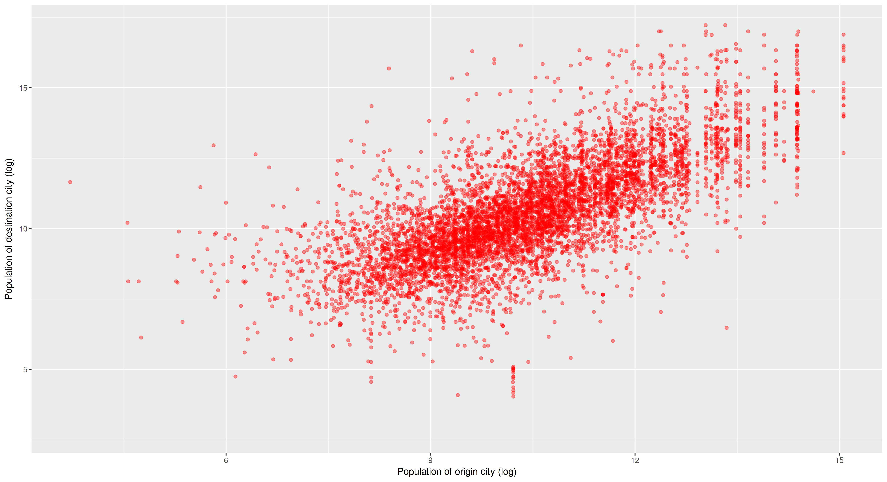
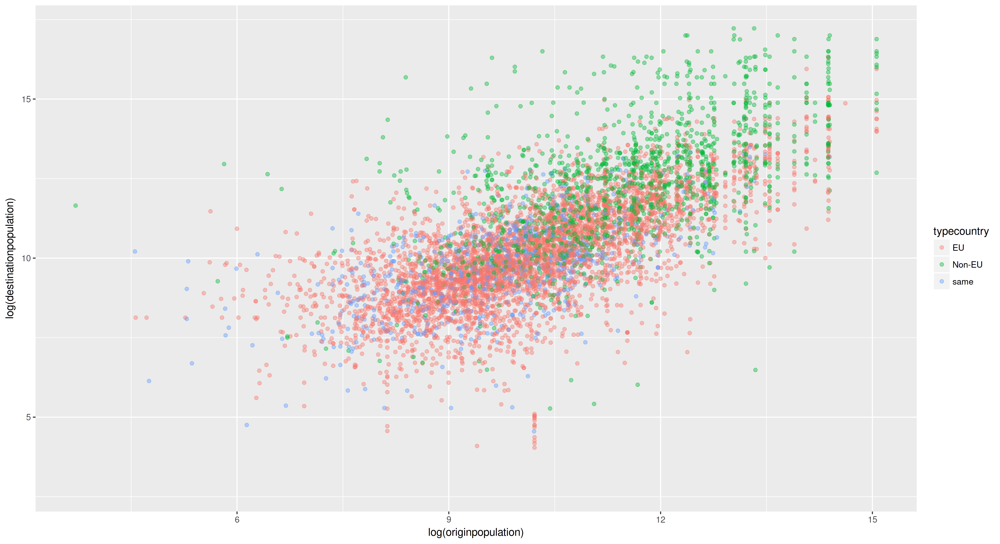
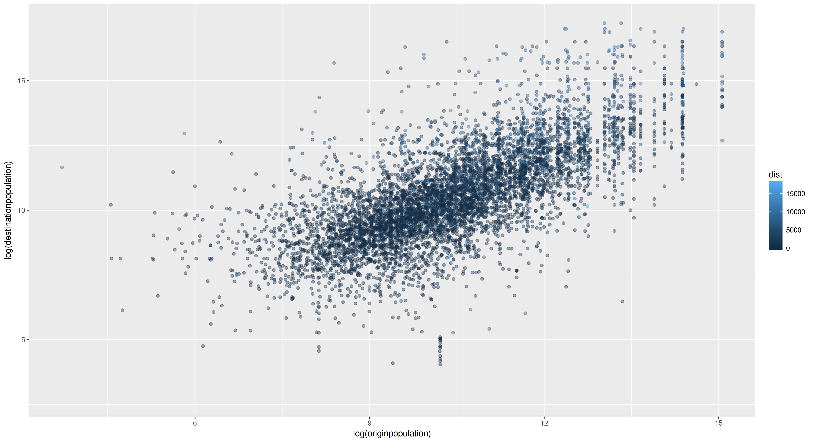
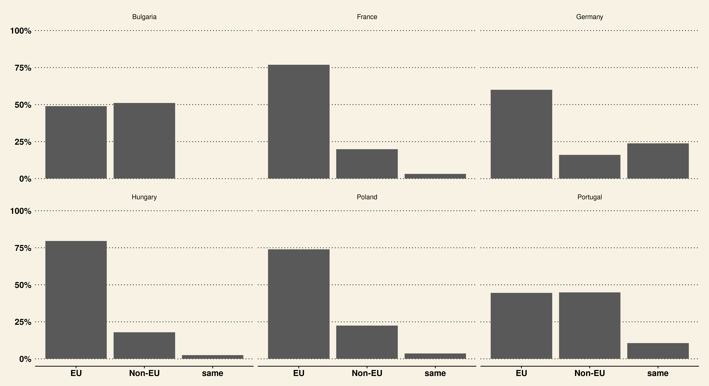
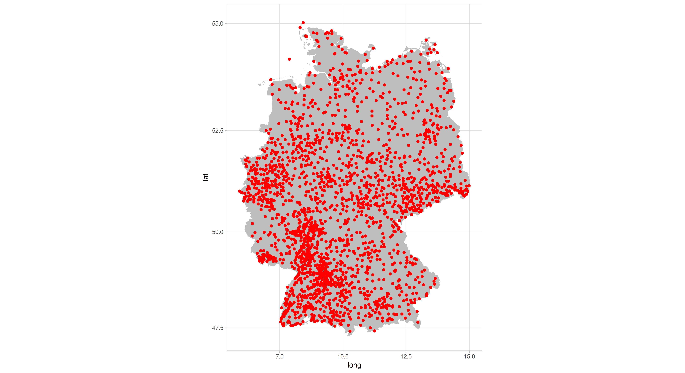

# Introduction and lesson goals 

Getting data and analyzing them is one of the most important tasks a historian has to face. Data are nowadays becoming omnipresent, but it
is not always easy to know how to extract them from the different
places we can find them on/in the web. In the last years the so-called
*semantic web* has been developped. The idea behind it is to
categorise concepts and data and, above all, put all them in
relationship. Once you have the data you can analyze them and plot
them with R. 

By the end of this lesson you will be able:

1. to extract data from wikidata using the query language SPARQL,
2. to import the extracted data into R,
3. to plot the data using the package ggplot2,
4. to plot the data in maps with ggplot2.


# Wikidata: Cities and sister cities in Europe 

The analysis behind this tutorial is a very simple one. I was always fascinating by the fact that many cities have sister cities around the world. As a historian a lot of relevant questions arise out of this empirical fact. For instance, when did this phenomenon begin (probably in the 19th century)? Why are the reasons behind the whole phenomenon? And more concrete: which are the concrete reasons for a city to seek for such relationships (economic, religious, cultural)? Or even more concrete: are German cities related to French or Polish cities, maybe as a an attempt to overcome deep historical tensions? Have Spanish cities proportionally more relationships to the spanish-speaking American cities? Do small cities (<10000) have also such relationships? Are EU-cities more related to other EU-cities or is this aspect not relevant at all? Do cities of former communist countries more relationships with other cities of the present Russia or other former communist countries?

But: where do to get such data? [Wikidata](https://www.wikidata.org/wiki/Wikidata:Main_Page), the free and open knowledge base, is of course the best option. The question is therefore: how do we get the data of the sistercities of European cities? Wikidata has already this information. We only have to query it. 
 [Programming historian](http://www.programming-historian.org) añadir!! has already two excellent tutorial on wikidata:  for specific issues in wikidata the more general and  friendly [introduction](https://www.wikidata.org/wiki/Wikidata:A_beginner-friendly_course_for_SPARQL) and for a more [technichal description](https://www.wikidata.org/wiki/Wikidata:SPARQL_query_service/queries). 


I have prepared some queries using SPARQL in order to get all cities of EU countries and their sister cities. The queries are rather complex. For instance the query to get the Polish cities looks [like this](http://tinyurl.com/y7g8cpp2): 

```{sparql}
SELECT DISTINCT ?origincityLabel ?origincountry ?originlat ?originlong ?originpopulation
                ?sistercityLabel ?destinationlat ?destinationlong ?destinationpopulation
                ?destination_countryLabel ?dist ?eu
WHERE {

  # selection of the origincity with coordinates and population in a subquery
  {
  SELECT DISTINCT ?origincity (SAMPLE(?lat_o) as ?originlat) (SAMPLE(?lon_o) as ?originlong) ?originpopulation WHERE {
    ?origincity (wdt:P31/wdt:P279*) wd:Q486972 ; 
                                    wdt:P17 wd:Q36  .           # ... in Poland
    
    # get the coordinates of origincity 
    ?origincity p:P625 ?statement .                             # is there a coordinate-location statement?
    ?statement psv:P625 ?origin_coordinate_node .               # ... which are the coordinates?
    ?origin_coordinate_node wikibase:geoLatitude  ?lat_o .      # ... extract the latitude
    ?origin_coordinate_node wikibase:geoLongitude ?lon_o .      # ... extract the longitude 

    OPTIONAL { ?origincity wdt:P1082 ?originpopulation. } }     # get the population of origincity if there is any data
    
    GROUP BY ?origincity ?originpopulation
  }
  
  # look for infos about sister cities of origincity
  ?origincity p:P190 ?sistercity_statement .
  ?sistercity_statement ps:P190 ?sistercity .

  # get the coordinates of sistercity 
  ?sistercity p:P625 ?destination_coordinate_node_statement .
  ?destination_coordinate_node_statement psv:P625 ?destination_coordinate_node .
  ?destination_coordinate_node wikibase:geoLatitude ?destinationlat .
  ?destination_coordinate_node wikibase:geoLongitude ?destinationlong .

  # get the country of sistercity 
  ?sistercity wdt:P17 ?destination_country .

  # is the destination_country a EU country?
  OPTIONAL { ?destination_country p:P31 ?eustatement .
             ?eustatement ps:P31 wd:Q185441 . }
  BIND(IF(BOUND(?eustatement), "EU", "Non-EU") as ?eu)

  OPTIONAL { ?sistercity wdt:P1082 ?destinationpopulation. }  # get the population of sistercity if there is any data

  # calculate the distance between the two cities
  ?sistercity wdt:P625 ?coord_d .
  ?origincity wdt:P625 ?coord_o .
  BIND(ROUND(geof:distance(?coord_o, ?coord_d)) as ?dist)

  # not very elegant, but we want to avoid timeouts...
  BIND("Poland" as ?origincountry)

  SERVICE wikibase:label { bd:serviceParam wikibase:language "en". }
}

```

I do not want to explain the query itself, since you have already excellent tutorials on AÑADIR. The queries for all EU countries can be found here. 

Running this query against the [wikidata server](https://query.wikidata.org/) you will get a table with the results, that you can export into different formats. We want to export them as TSV (tab separated values). Since some queries sometimes failed due to the timeout limitations of the wikidata servers, you have the downloaded data and you can find them [here]. 

# Starting with R: getting and preparing the data

Actually there are several ways to get the data into R for further analysis: 

1. exporting the results as CSV/TSV (comma/tab separated values) or JSON, which is what I did,
2. using one of the different R packages which are able to connect to a SPARQL endpoint and get the data (a general package, [SPARQL](https://cran.r-project.org/web/packages/SPARQL/index.html), and a specific one for using with wikidata, [WikidataR](WikidataR)).
3. downloading the data to your computer with one of the available programs for doing this (I can recommend [wikidata-cli](https://github.com/maxlath/wikidata-cli)).

In the present tutorial we will use only the data of six EU-countries: Germany, France, Poland, Hungary, Portugal, Bulgaria (three of so-called Western Europe and three of so-called Eastern Europe). But if you want to play with the data of all EU-countries you can find it here. 

For this lesson, I recommend you that you create a directory in your computer for the project and inside it you can create two other directories you will use: `data` and `maps`. Put the `tsv` files into the data directory. Open R or Rstudio, make the project directory your working directory (with `setwd`) and then load the data into R: 

```{r}
bulgaria <- read.csv("data/bulgaria.tsv", header = T, sep = "\t")
france <- read.csv("data/france.tsv", header = T, sep = "\t")
germany <- read.csv("data/germany.tsv", header = T, sep = "\t")
hungary <- read.csv("data/hungary.tsv", header = T, sep = "\t")
poland <- read.csv("data/poland.tsv", header = T, sep = "\t")
portugal <- read.csv("data/portugal.tsv", header = T, sep = "\t")

# we create a dataframe with the countries
eudata <- rbind(bulgaria, france, germany,
                hungary, poland, portugal)

# we remove the previous variables
rm(bulgaria, france, germany,
   hungary, poland, portugal)
```

Doing so, we have a dataframe `eudata` with the data of the six countries. There are 13081 rows with 15 variables (if you have downloaded the data yourself, the number of rows can be different). You can check its structure it using: 

```{r}
str(eudata)
```

As you can see we have the following information in the dataframe: the name of the "origin city", that is the city whose sister cities we are looking for (in the column `origincityLabel`), the country (`origincountry`), the coordinates (in `originlat` and `originlong`) and the population (`originpopulation`). The same information ofr the sister city. Moreover we have the column `dist` with the distance between the two cities (in km) and the categorial column `eu` which informs us whether the "destination city" is in the EU or not. 

This data are however not complete and it is a good idea to add some information. We want to add two additional columns. The first one holds the information whether the sister city is in the same country as the origin city (`samecountry`). We create Moreover a column (`typecountry`) with a categorical variable with three values according to the fact of the sister city is in the same country, in a EU-country or in a non-EU-country.

I will not explain the details of these transformations. 
If you want to know how to manipulate data in R, the best option nowadays is to use the package [dplyr](https://cran.r-project.org/web/packages/dplyr/index.html) created by [Hadley Wickham ](http://hadley.nz/), which is included in the metapackage `tidyverse` we have already loaded. You can find a [good tutorial](http://programminghistorian.github.io/ph-submissions/lessons/data_wrangling_and_management_in_R) to using dplyr written by Nabeel Siddiqui. 

```{r}
eudata$samecountry <- ifelse(as.character(eudata$origincountry) ==
                             as.character(eudata$destination_countryLabel), "same", "different")
eudata$samecountry <- as.factor(eudata$samecountry)

# you need at least dplyr version > 0.7 for this code!
eudata <- eudata %>% dplyr::mutate(typecountry = case_when(samecountry == "same" & eu == "EU" ~ "same",
                                             samecountry == "different" & eu == "EU" ~ "EU",
                                             samecountry == "different" & eu == "Non-EU" ~ "Non-EU"))
eudata$typecountry <- factor(eudata$typecountry)
```

If you do not want to follow these steps, you can download this dataframe [from here] and load it into R in this way:

```{r}
load("sistercities.Rdata")
```

# Graphics with ggplot2

There are several ways to analyze the data we have prepared, but in this tutorial we will concentrate on their graphical representation. In R there are three main possibilities to create graphs: the [plotting functions](https://stat.ethz.ch/R-manual/R-devel/library/graphics/html/plot.html) provided by the standard installation of R, the package [lattice](http://lattice.r-forge.r-project.org/), and finally [ggplot2](http://ggplot2.tidyverse.org/), which is the system we will learn here.

## ggplot2: General aspects 

But why should you use ggplot2 at all? If you plan to work with R, ggplot2 has many advantages:

1. it is very powerful, but at the same time relatively simple, 
2. it creates beautiful publication-ready graphs,
3. it has a lot of [extensions](http://www.ggplot2-exts.org/) which are increasingly being developed by the community. They enhance the possibilities of ggplot2 adding new functions, new types of graphs, new themes, etc.
4. it also has the possibility to create maps.

Creating good graphics is a complicated issue, because you have to take into account many different aspects: the information you want to convey, the many possibilities of showing this information (scatterplots, boxplots, histogramms, and so on), the many aspects of a plot which can be adapted (axes, transformation of variables, legends, etc.), and so on.  But how does ggplot2 cope with this complexity? ggplot2 is based on a theoretical book which proposes a so-called [*grammar of graphics*](https://www.amazon.com/Grammar-Graphics-Statistics-Computing/dp/0387245448/ref=as_li_ss_tl?ie=UTF8&qid=1477928463&sr=8-1&keywords=the+grammar+of+graphics&linkCode=sl1&tag=ggplot2-20&linkId=f0130e557161b83fbe97ba0e9175c431) (hence the *gg* in the name ggplot2) written by [Leland Wilkinson](https://en.wikipedia.org/wiki/Leland_Wilkinson). But, don't panic: you don't have to know anything about grammar. The main idea is that a plot is made up of a set of independent components that can be composed in many different ways. In brief we will see how to do it.

There is plenty of information about ggplot2 on the web, but I recommend you:

1. the best source of information is of course the book written by the author himself which has been recently [published](http://www.springer.com/br/book/9783319242750). The book is also available [online](https://github.com/hadley/ggplot2-book),
2. for a general overview of the package you can visit the [documentation](http://docs.ggplot2.org/current/) of the package,
3. very useful are also the webpage [Cookbook for R](http://www.cookbook-r.com/Graphs/) (based on the book [*R Graphics Cookbook. Practical Recipes for Visualizing Data](http://shop.oreilly.com/product/0636920023135.do) by Winston Chang) and the cheatsheet you can find [here](https://www.rstudio.com/resources/cheatsheets/).

But, first of all, in order to use ggplot we have of course to install it. Actually I recommend to install the metapackage `tidyverse` which is a collection of packages written mainly by Wickham for doing most of the most useful operations with dataframes ([dplyr](http://dplyr.tidyverse.org/), [readr](http://readr.tidyverse.org/), [tidyr](http://tidyr.tidyverse.org/), [forcats](http://forcats.tidyverse.org/), etc.). ggplot is among the packages contained in the [metapackage `tidyverse`](http://tidyverse.org/). 

```{r}
install.packages("tidyverse")
# or only ggplot2
# install.packages("ggplot2")
```

## A first example: a scatterplot of population data

But, let's begin with a small example which we will slowly modify. In our data we have the population of the origin city and the destination city. We could be interested in knowing whether population is a related variable, that is: are small/big cities more often related to cities in their population range? We could do this using a [scatterplot](https://en.wikipedia.org/wiki/Scatter_plot) showing both population data. In ggplot this coud be done as follows (we use the natural log of the population data to overcome the skewness of the data):

```{r}
library(ggplot2)

ggplot(data=eudata, aes(x=log(originpopulation), y=log(destinationpopulation)))
```

A small trick to learn ggplot2 is to think about the creation of plots like the construction of sentences. We are telling R the following: "create a ggplot graph using the
dataframe cities and map the variable originpopulation to x and destinationpopulation to y". As you can see, the
structure is very straightforward, except for the use of *aes*, which
means in ggplot parlance *aesthetics*. It is maybe a not very telling
expression, but the idea is very simple: we tell R that it has to map
the variables in the graph with these columns of the dataframe.

If you press return now, you will be surprised: you will get an empty
plot! Axes and plot area are there, but the data are not represented.
This is however the expected behaviour. We have to tell R/ggplot2
which type of plot we want to create. That means: we need to add a layer to plot. Adding different layers is the way to construct plots with ggplot. 

In ggplot there are different types of layers [cómo coño poner esto?].
One crucial type of them is the so-called  *geom* (from *geometries*) layer. As we will see, there are plenty of different layers (and many more in packages which extend ggplot2 functionality). Since we want to create a scatterplot, we need the `geom_point()` layer. Therefore we add a layer to our plot using the command `+`:

```{r}
ggplot(data=eudata, aes(x=log(originpopulation), y=log(destinationpopulation))) + geom_point()
```

Now we have a scatterplot relating both variables (if you're using the data I gathered, you will get a message that ggplot2 removed 6429 rows containing missing values, because some cities do not have information about their population). Nevertheless, I think you would like to improve the quality and appearance of the plot, since some aspects are not very convincing: the labels of the axes, the plot's background, the overplotting (too many points), and so on. As you see, ggplot2 makes several different decisions for you in terms of plot appearance. They are often not bad, but we want to be able to adapt plots to our needs. 

Every single plot's aspect can be manipulated. There are three different elements which are worth looking at:

1. every ggplot2 function (eg. `geom_point()`) can take arguments to modify concrete
   aspects, 
2. *scales* control the way variables are mapped from the data to the
   plot. This affects axes, legends, etc.
3. *themes* refer to the 'static' elements of the plot: the
   background's elements (color, lines, etc.), the fontsize, etc. 

We will begin with the most simple transformation: we want to change the color
of the points and since we have a lot of points we want to add some transparency to the points:

```{r}
ggplot(data=eudata, aes(x=log(originpopulation), y=log(destinationpopulation))) + geom_point(color="red", alpha=0.4)
```

As you can see, this can be easily done: every function can get
arguments with which you can influence how the functions makes its
job. The function `geom_point()` can take different arguments which
are very straightforward. You can see them under the section
*Aesthetics* in the help of `geom_point()` by typing `?geom_point` in
R or [here](http://ggplot2.tidyverse.org/reference/geom_point.html)
online. As expected, you can manipulated things like the color, the size, the shape, etc. of the points by using the corresponding argument. 

The graph shows a very clear pattern of lineal relationship between cities' populations: the more population a city has, the bigger the sistercities it has. 

But we want also to add titles to the axes. Manipulating axes (and
legends) is done by using the corresponding `scales` functions. We
will see it later on. But since changing the titles is a very common action, ggplot has shorter commands to do it: `xlab()` and `ylab` (*lab* stands for *label*):

```{r}
ggplot(data=eudata, aes(x=log(originpopulation), y=log(destinationpopulation))) +
    geom_point(color="red", alpha=0.4) +
    xlab("Population of origin city (log)") +
    ylab("Population of destination city (log)")
```



For the time being, we will let our graph such it is, without making
any other changes. Before explaining how to change other elements, let us try another graph with another `geom`.

## Adding information to graphs (colors, shapes, etc.). The use of `scales`

In many cases we want to add information to a graph using different
colors (or shapes) for every group. Taking our dataset we could color
the points of our previous scatterplot using different colors for the
different types of cities (in the same country, in a EU-country or in
a non-EU-country). Let's  create a first version of this new graph
using the previous code: 

```{r}
ggplot(eudata, aes(log(originpopulation), log(destinationpopulation))) +
    geom_point(alpha=0.4, aes(color=typecountry)) +
    xlab("Population of origin city (log)") +
    ylab("Population of destination city (log)")
```



Three aspects are here relevant:

1. I remove the name of some parameters (`data`, `x`, `y`), since
   ggplot2 is intelligent enough to figure them out.
2. most important: we modify `geom_point()` adding an argument: `aes(color=typecountry)`. Why do we use `aes()` and not just `color=typecountry` without putting it inside of `aes()`? You can try it (you will get an error). The reason is very easy: using `aes()` we are telling ggplot2 that it has to map the argument `color` to the variable `typecountry`. In other words: we are telling ggplot that `typecountry` is a variable of the data we are using. 
3. ggplot has made some decisions for us: it selects colors on its own
   and it puts automatically a legend. 

Let's say you want to use different shapes for the country's types.
You could try this code: 

```{r}
ggplot(eudata, aes(log(originpopulation), log(destinationpopulation))) +
    geom_point(alpha=0.4, aes(shape=typecountry)) +
    xlab("Population of origin city (log)") +
    ylab("Population of destination city (log)")
```

### Scales: XXXXX ###

But: how can we modify colors and legend? The so-called `scales` are
your friend. Citing the ggplot2 book: "scales control the mapping from
data to aesthetics. They take your data and turn it into something
that you can see, like size, colour, position or shape". And at the
same time, scales provide the tools that let you read the plot: the
axes and legends. Actually ggplot is always using per default scales when you create a graph.

Nevertheless I have to admit scales are maybe the least intuitive
element in ggplot2. There
are
[many different scales](http://ggplot2.tidyverse.org/reference/#section-scales) you
can use. But let's take a look at it with our previous graph.

In our graph we can control 3 different scales: 

1. `scales_x_continuous()` which controls the x-axes,
2. `scales_y_continuous()` which controls the y-axes,
3. `scales_colour`: which controls the color(s) used. 

We will take a look at the possibilities of changing colors.
(Nevertheless I have to warn you: the selection of colors for graphs
is by no means an easy task; there is a lot of theoretical work done
on this). We could do several things: manually passing some colors,
using a color scala, 

[atención: aquí hay el problema que la puta leyenda sale con alpha!]

First of all we store our graph in a varible to use it several times, changing only some aspects. This is a very convenient way of ggplot2 to make different versions of the same graph:

```{r}
p2 <- ggplot(data=eudata, aes(x=log(originpopulation), y=log(destinationpopulation))) +
    geom_point(alpha=0.4, aes(color=typecountry))
```

Now we can add manually the colors we want using `scale_colour_manual()`.

```{r}
p2 + scale_colour_manual(values = c("red", "blue", "green"))
```

As you see, `scale_colour_manual()` takes a compulsory argument, namely a vector with the names of colors. This could also be a vector of HTML color codes.

In this way we can create graphs with our preferred colors. But often it is more recommendable to use already defined colors scalas, such as the [color brewer palettes](http://colorbrewer2.org/). ggplot has already these palettes [integreated](http://ggplot2.tidyverse.org/reference/scale_brewer.html) and a specific `scale` for using them. For instance: 

```{r}
p2 + scale_colour_brewer()
```

`scale_colour_brewer()` has different [palettes](http://ggplot2.tidyverse.org/reference/scale_brewer.html#palettes). You can try for instance: 

```{r}
p2 + scale_colour_brewer(palette = "Greens")
p2 + scale_colour_brewer(palette = "Set1")
p2 + scale_colour_brewer(palette = "Pastel1")
```

But let's look at another slightly different example. In the last graph we used a qualitative variable (`typecountry`) with different colors. But what about a continuous variable? Let's say we want to represent with a red scale the distance between the cities. 

```{r}
p3 <- ggplot(eudata, aes(log(originpopulation), log(destinationpopulation))) +
    geom_point(alpha=0.4, aes(color=dist))

p3
```



As you can see, there are two problems with this graph: blue is the used color and not red; the scala is not convincing since null is represented by the more oscuro??? Again we need to use scales, but in this case another command. As you can see, ggplot does not use in this case discrete colors (that is, one color per every value in the qualitative varible, for every factor in R parlance), but only one color which is graduated[???]. For this reason the scale we have to use is one  deals with gradients. There are [several for doing this](http://ggplot2.tidyverse.org/reference/scale_gradient.html). We will use `scale_colour_gradient`. We can define the low and the high value of the gradient. For instance: 

```{r}
p3 + scale_colour_gradient(low = "white", high = "red")
```

Other scales with gradients (`scales_colour_gradient2` and `scales_colour_gradientn`) have other possibilities. I encourage you to explore them looking at the [documentation page](http://ggplot2.tidyverse.org/reference/scale_gradient.html).


## Bar graphs 

Now we are interested in another aspect of our data. We want to know  which percentage of destination cities are in the same country, how many in other EU-country and how many outside the EU. And we want to split the graph so that every EU-country has its own graph.

Let's begin with the most simple one. we need another `geom`, namely
`geom_bar()`. Actually this can be simply done with this code: 

```{r}
ggplot(eudata, aes(x=typecountry)) + geom_bar() 
```


But this is not want we exactly want. Percentages would convey more
information than raw data. There are several ways for doing this. One
of them is transforming the data. One way of achieving it, is as
follows (I do not want to explain this code since this is not a
tutorial about `dplyr`). What we get is a dataframe with percentages. We can represent it so:

```{r}
eudata.perc <- eudata %>%
    group_by(typecountry) %>%
    summarise(total=n()) %>%
    mutate(freq= total/sum(total))

print(eudata.perc)

ggplot(eudata.perc, aes(x=typecountry, y=freq)) +
    geom_bar(stat="identity")
```


There is an important difference between the first barplot and this
one. In the first plot ggplot2 counted itself the number of cities in every group (in the original dataframe this information is not present). But in this case our dataframe already contains the value ggplot must use for plotting the bars. In this case, we need to tell ggplot where it can find the value by setting `y=freq` and (this is the tricky point) by using the `stat` argument of `geom_bar()`: per default `geom_bar()` uses internally `stat="count"`, which means, that it counts the number of ocurrences. But now we tell it that it has to use the number found in `y`.

Nevertheless this graph is still not convincing to me. I would like to
improve it by making the following changes: change the y axis to range
from 0 to 1 and show a percentage symbol (%) in the y axis. Let's see
the code and then I will explain it: 

```{r}
p4 <- ggplot(eudata.perc, aes(x=typecountry, y=freq)) +
    geom_bar(stat="identity") +
    scale_y_continuous(lim=c(0,1), labels = scales::percent_format())

p4
```


 As already mentioned, axes are changed using the `scales` functions. I have to admit this is in ggplot a little bit confusing since there are many different `scales` functions [as you can see etc.]. [añadir tal vez lo que dice el manual]

But let us see it with an example: 

Since we want to change the y-axis we use a `scale_y` function and since the y-axis in our plot is a continuous variable we use `scale_y_continuous`. 


## Faceting a graph 

But imagine that we would like to represent the same data, but in separated graphs per country. For doing this ggplot2 has powerful possibilities, which are summarised under the label *facetting*. The most simple facetting function is `facet_wrap()`, but you can also take a look at the richer `facet_grid()` (see [here](http://ggplot2.tidyverse.org/reference/facet_grid.html) the doc).

For doing this, we have to calculate the percentage per country into a new variable (`eudata.perc.country`) and then we create the graph: 
```{r}
eudata.perc.country <- eudata %>%
    group_by(origincountry, typecountry) %>%
    summarise(total=n()) %>%
    mutate(freq= total/sum(total))

p5 <- ggplot(eudata.perc.eu, aes(x=typecountry, y=freq)) +
    geom_bar(stat="identity") +
    scale_y_continuous(lim=c(0,1), labels = scales::percent_format()) +
    facet_wrap(~origincountry)

p5
```

We have only added the function `facet_wrap(~origincountry)` to the previous command. By doing so, we tell ggplot2 to create one graph per country. Important is the use of the operator `~` which is very often used in R for the so-called formulae. [añadir!] The result is as follows: 


ggplot2 also provides a function `facet_grid()` which is more powerful. You can see some examples [here](http://ggplot2.tidyverse.org/reference/facet_grid.html). 

## Themes: changing elements of the XXXX

Modifying the appearance of the graph is also one of the most frequent requirements. This can be achieved in ggplot2 with the use of `themes`. Themes give you control over things like fonts, ticks, panel strips, and backgrounds. ggplot2 comes with a number of built-in themes. The most important are `theme_grey()`, `theme_bw()`, `theme_dark()`, `theme_void()`, etc. Moreover the most important point is that you can easily create you own themes and use them in your plots. 

ggplot2 uses per default `theme_grey()`.  It is very easy to use another theme. Using the last graph: 

```{r}
p5 + theme_bw()
```


Several packages add additional themes to ggplot2. You can for instance install [`ggthemes`](https://github.com/jrnold/ggthemes) where you will find themes such as `theme_excel` (a theme replicating the classic ugly gray charts in Excel), `theme_wsj` (a theme based on the plots in the *The Wall Street Journal*), etc. For instance using this last theme: 

```{r}
install.packages("ggthemes")
library(ggthemes)

p5 + theme_wsj()
```



But more interesting is of course the possibility to modify yourself some aspects of the graph. There are two main possibilities: 

1. create your own theme, taking for instance the code of the existing ones and modifying the concrete aspects you are interested in. The definition of the default themes can be found [here](https://github.com/tidyverse/ggplot2/blob/master/R/theme-defaults.r). 
2. modify concrete aspects of the theme we are using. This is the approach we will follow here. 

Modifying concrete aspects of a theme can be achieved by means of the function `theme()`. Unfortunately it is not possible in such a lesson to get into every single aspect which can be manipulated by using `theme()`. [Here](http://ggplot2.tidyverse.org/reference/theme.html) you can find how many different arguments can be used (and see some examples): panel.grid.major, panel.grid.minor, plot.background, legend.background, legend.margin, and many others. Relevant is however the fact that by using `theme()` actually we are modifying the default theme we are using. That means: we modify some aspects. 

For instance, let say we want to put the legend of the previous scatterplot in the bottom of the graph. This can be achieved by means of the following code:

```{r}
p2 + theme(legend.position = "bottom")

```

We could also for instance remove the lines of the grid in one of the previous bargraphs modifying the white/black-theme (`theme_light()`):

```{r}
p5 + theme_light() +
    theme(panel.grid.major.x = element_blank(),
          panel.grid.minor.x = element_blank())

```


[tal vez añadir ref a esto: http://ggplot2.tidyverse.org/reference/element.html]

## Extending ggplot2 with other geoms

As already mentioned, one of the strengths of ggplot2 is that is increasingly becoming a standard for plotting in R. For this reason, a lot of [extensions](http://www.ggplot2-exts.org/) are being added to R. You can create with them [network graphs](https://briatte.github.io/ggnetwork/), [radar charts](https://github.com/ricardo-bion/ggradar), [time series graphs](https://github.com/AtherEnergy/ggTimeSeries), and many more. Their use is incredibly easy. Let's see an example. 

Imagine that we want to plot the number of countries a EU-contry has relationships with. That means: with how many countries do for instance german cities have relationships? Or: which is the EU country with the most (least) connections? 
We could do this with a barplot, but instead of a barplot we can construct a so called lollipop graph. This can be achieved with the package `ggalt` (see [here](https://github.com/hrbrmstr/ggalt)). 

First of all we need to install the package, then we create a dataframe which summarises the information we want to show in the graph and, finally, we plot the graph. This can be done for instance in the following way:

```{r}
# if you do not have the package, install it 
# install.packages("ggalt")
library(ggalt)

# we summarise the data
eudata.percity <- group_by(eudata, origincityLabel) %>%
    summarise(total = n()) %>%
    arrange(-total)

# we filter the first 25 Cities
eudata.percity.filtered <- slice(eudata.percity, 1:25)

# we plot the data 
ggplot(eudata.percity.filtered, aes(x = reorder(origincityLabel, total), total)) +
    geom_lollipop(point.colour = "red", point.size = 2.75) +
    coord_flip() +
    theme_pander() +   # you need library(ggthemes)
    theme(panel.grid.major.x = element_line(color = "black")) +
    labs(x = NULL, y = NULL,
         title = "Cities with most relationships",
         caption = "Data: wikidata.org")
    
```


Some aspects are relevant here:

  * we have to order the data using the function `reorder` to get a descendent order of the Cities,
  * we use some arguments in the `geom_lollipop()` such as size, colour, etc. You can get a list by looking at `?geom_lollipop`. 
  * we use a new command: `coord_flip()` with which we can "rotate" the graph. 
  * we use `theme_pander()` (from the package `ggthemes`) and modify some aspects such as the lines of the grid. 

# Maps 

Representing geographical information is becoming increasingly useful and demanded. In the opensource world you can find several rich programs to deal with geographical information (both creating maps and making geostatistical analysis) [QGIS](http://www.qgis.org/), [gvSIG](http://www.gvsig.com/), [GRASS](https://grass.osgeo.org/), and also R. As for R, you can find a very informative site about spatial methods [here](https://cran.r-project.org/web/views/Spatial.html).

As always in R, there are several ways to create maps. You can use:
the ggplot2 package which is the method we will learn here. But there are also the very powerful
package [sp](https://cran.r-project.org/web/packages/sp/index.html). New packages are also
being developed, such
as [cartography](https://github.com/Groupe-ElementR/cartography). 
Honestly speaking, this richness implies also some complications, since every package has its own syntax and its own specifities. In the present lesson we will stick with ggplot2, but I encourage you to make experiments with other packages, such as the very promising new package `cartography`. 

Spatial information can be stored in a huge variety of formats ([shapefiles](https://en.wikipedia.org/wiki/Shapefile), [raster data](https://en.wikipedia.org/wiki/Raster_graphics), etc.). In order to deal with spatial data in R, the packages [`rgeos`](https://cran.r-project.org/web/packages/rgeos/index.html) and [`rgdal`](https://cran.r-project.org/web/packages/rgdal/index.html) are very convenient, since they enable us to read a wide range of spatial formats. We install and load them so:
```{r}
install.packages(c("rgeos", "rgdal"))
```
While the possibilities of presenting spatial information are manifold, we will restrict us in the present lesson to a basic example of create a map with the city data we have collected. I will  stress the fact that creating maps with ggplot2 follows exactly the same principles we have seen so far for other graphs created with ggplot2. 


## Points 

We will begin with a simple map to show where are the bulgarian cities of our data. We want to see a map in which some information is conveyed: where are the cities which have relationships. The most simple way to do this is to show a point for every city. But first we need to get a map to operate with. Again we find here two possibilities [o dejarlo?]. We will 

But first of all we need maps. There are several open sources to get maps. For political maps you can use [GADM](http://gadm.org/) where you will find maps in different formats for every land of the world. We will [download the map for Bulgaria](http://gadm.org/country) as shapefile (there is also a format for R and its package `sp`, but forget it for now). You get a zip file with the name `BGR_adm_shp.zip`. After unzipping it, you will get a lot of files, but we are interested only in the `BGR_adm1` files (`BGR_adm1_shp`, `BGR_adm1_dbf`, etc.), which represent Bulgaria and its provinces.

Now we will create the map. First of all, we have to read the spatial data, then we read again the data about the german cities (we could also filter our dataframe `eudata`) and finally we make the plot. 
```{r}
library(rgdal)
bulgaria.map <- readOGR("BGR_adm1.shp") # change the path accordingly
bulgaria.cities <- read.csv("data/bulgaria.tsv", header = T, sep = "\t")
ggplot() +
      geom_polygon(data = bulgaria.map, aes(x = long, y = lat, group = group), fill="grey70") +
      geom_point(data = bulgaria.cities, aes(x = originlong, y = originlat), color = "red") +
      coord_map() +
      theme_light()
```



Following aspects are relevant here: 
  * we read the spatial data with the function `readOGR()` of the package `rgdal` which is a kind of swiss knife, since it reads a lot of spatial formats, 
  * we create a complete void ggplot with `ggplot()` and add to it different layers, 
  * as you see the first layer is a new `geom` of ggplot2: [`geom_polygon()`](http://ggplot2.tidyverse.org/reference/geom_polygon.html) which permits us to plot spatial data; and we pass to it the parameter `grey70` as fill color,
  * maybe you are astonished by the `aes()` we use in `ggplot()`: `x`, `y` and `group` are variables which are inside the variable `bulgaria.map`. This is a convention for shapefiles. Do not worry too much about it. 
  * important is the fact that we add a new layer (remember: plots are created adding layers) with the data in the form of a `geom_point()` in which we pass the arguments for the coordinates (which are in our dataframe `bulgaria.cities`). 
  * then we use another new function of ggplot2: `coord_map()`. This is necessary for getting a map which has the usual shape we are accustomed. Try to plot the map without this function. It works, but the projection is strange. All this is related to one of the most complicated areas in the creation of maps: the [projection](https://en.wikipedia.org/wiki/Map_projection). This is a wide topic I do not want to deal here with. In ggplot2 you can use [`coord_map()`](http://ggplot2.tidyverse.org/reference/coord_map.html) with different arguments to cope with this issue.  

But I think we could enhance a little bit the graph. Again: what we have already learnt about ggplot2 is still relevant for maps (which is of course very useful). 

Let's say we want to plot some relevant aspects of our data. For instance, it could be interesting to add to the plot information about the of the cities and the number of relationships it has. That is: one could expect that bigger cities has more sister cities (which is not always the case) and it could be interesting to make a plot to see it. 

First of all we calculate the number of sister cities per bulgarian city: 
```{r}
bulgaria.mod <- bulgaria %>%
      group_by(origincityLabel, originlat, originlong, originpopulation) %>%
      summarise(total = n())
```

Now we will create a rather complex map using most of the features of ggplot2 we have learnt in this lesson. Do not panic about the long code. We will explain it line by line: 

```{r}
bp1 <-
      ggplot() +
      geom_polygon(data = bulgaria.map,
                   aes(x = long, y = lat, group = group),
                   fill = NA, color = "grey80") +
      geom_point(data =  bulgaria.mod,
                 aes( x = originlong, y = originlat, size = originpopulation, color = total)) +
      coord_map() + theme_void() +
      scale_size_continuous(breaks = c(50000, 100000, 250000, 500000, 1000000),
                            labels = NULL, 
                            range = c(3, 10),
                            guide  =  guide_legend(title = "Population",
                                                   title.position  =  "top" )) +
      scale_colour_gradient(name  = "Number of connexions",
                            low  =  "lightblue3", high  =  "blue4",
                            guide = guide_colorbar(draw.ulim  =  FALSE,
                                                 draw.llim  =  FALSE,
                                                 title.position  =  "top")) +
    theme( legend.position  =  "bottom")

bp1
```

What we are doing is the following: 

  1. we put the graph in a variable, because we will add some elements later on,
  2. we use the same structure as in the previous graph, but we add two parameters to `geom_point()`, namely `size` and `color` and map them to two variables (`originpopulation` and `total`),
  3. we use two scales (`scale_size_continuous` and `scale_colour_gradient`) to control how these two variables are represented and how this is explained in the legend (this is not compulsory; ggplot2 uses by itself both functions with default values),
  4. more precisely, with `scale_size_continuous` we control several things: 
	 * how many symbol (and with which values) should be represented for the population (the parameter `breaks`)
	 * that it should not show labels for them (the parameter `labels`)
	 * the range of the symbols (how big they should be)
	 * and the appearance of the legend (`guide`): that it should have a title and the position of this title. 
 5. with `scale_colour_gradient` we control several things: 
     * both colors for the lowest and the highest range 
	 * again the legend (`guide`): but in this case we select a colorbar (`guide_colorbar`) with title, position, and the parameters `draw.ulim` and `draw.llim` which control some ticks of the colorbar. 
  6. finally we put the legends in the bottom. 
  
We could even improve more the map by adding the name of the most relevant cities. Let's do it by using one of the new extensions of ggplot2: [`ggrepel`](https://github.com/slowkow/ggrepel). First we install the package, We will label the cities which have more than seven sister cities. We will create a new dataframe with this information. 

```{r}
install.packages("ggrepel")
library(ggrepel)

bulgaria.mod2 <- filter(bulgaria.mod, total>7)

bp2 <- bp1 +
      geom_text_repel(data  =  bulgaria.mod2,
                      aes(x = originlong, y = originlat, label = origincityLabel),
                      point.padding  =  unit(1, "lines"))

bp2
```

As you can see, we reuse the previous variable `bp1` in which we put our bulgarian graph and add a new layer, the labels, by means of the function `geom_text_repel`. It is also a `geom` and has the usual parameters: `data`, `aes`, etc. What do we need another dataframe for this geom? We could use the `bulgaria.mod`, but in this case `geom_text_repel` will use every city's name as label. `geom_text_repel` has a lot of parameters which control the appearance of the labels. In this case we used `point.padding`, but you can explore [other possibilities](https://cran.r-project.org/web/packages/ggrepel/vignettes/ggrepel.html) and in the help page (with `?geom_text_repel`). 


aquí hay una buena expolicación: https://github.com/Robinlovelace/Creating-maps-in-R tal vez coger eso...


[comment] # Local Variables:
[comment] # eval: (auto-fill-mode -1)
[comment] # eval: (visual-line-mode)
[comment] # eval: (visual-fill-column-mode)
[comment] # End:
