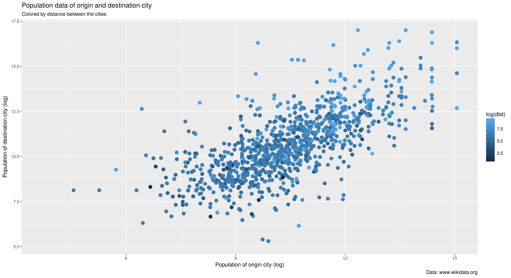
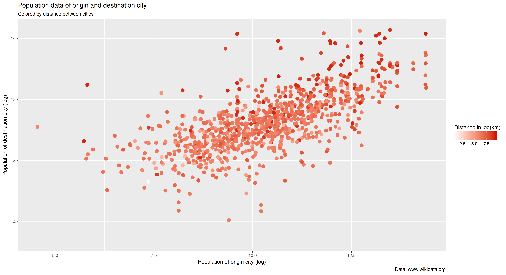

# Introduction and lesson goals 

Getting data and analyzing them is one of the most important tasks a historian has to face. Data are nowadays becoming omnipresent, but it
is not always easy to know how to extract them from the different
places we can find them on/in the web. In the last years the so-called
*semantic web* has been developped. The idea behind it is to
categorise concepts and data and, above all, put all them in
relationship. Once you have the data you can analyze them and plot
them with R. 

By the end of this lesson you will be able:

1. to extract data from wikidata using the query language SPARQL,
2. to import the extracted data into R,
3. to create barplots using the powerful graphics package ggplot2,
4. to create histograms with ggplot2,
5. to create scatterplots with ggplot2,
6. to create other types of new plots with ggplot2 extensions.


# Wikidata: Cities and sister cities in Europe 

The analysis behind this tutorial is a very simple one. I was always fascinating by the fact that many cities have sister cities around the world. As a historian a lot of relevant questions arise out of this empirical fact. For instance, when did this phenomenon begin (probably in the 19th century)? Why are the reasons behind the whole phenomenon? And more concrete: which are the concrete reasons for a city to seek for such relationships (economic, religious, cultural)? Or even more concrete: are German cities related to French or Polish cities, maybe as a an attempt to overcome deep historical tensions? Have Spanish cities proportionally more relationships to the spanish-speaking American cities? Do small cities (<10000) have also such relationships? Are EU-cities more related to other EU-cities or is this aspect not relevant at all? Do cities of former communist countries have more relationships with other cities of the present Russia or other former communist countries?

But: where do to get such data? [Wikidata](https://www.wikidata.org/wiki/Wikidata:Main_Page), the free and open knowledge base, is of course the best option. The question is therefore: how do we get the data of the sistercities of European cities? Wikidata has already this information which can be queried using SPARQL (for specific issues in wikidata the more general and  friendly [introduction](https://www.wikidata.org/wiki/Wikidata:A_beginner-friendly_course_for_SPARQL)). Using this query language we can extract this data. (If you are interested in the complex queries used for doing it, you can find them here)

Running the queries against the [wikidata server](https://query.wikidata.org/) you will get a table with results, that we can export into different formats. Exporting the results as CSV/TSV (comma/tab separated values) or JSON is probably one of the most simple solutions to have them ready for further analysis. 

# Starting with R: getting and preparing the data

In the present tutorial we will use only the data of six EU-countries: Germany, France, Poland, Hungary, Portugal, Bulgaria (three of so-called Western Europe and three of so-called Eastern Europe). The data for these countries can be downloaded here (if you want to play with the raw data of all EU-countries you can find it here). 

You also can run the queries again changing, but be aware that the data you will download will not probably be exactly the same that you can find in the providad file, since the data in wikidata are continuously being updated. 

For this lesson, I recommend you that you create a directory in your computer for the project and inside another called: `data`. Put the `tsv` file into this data directory. Open R or Rstudio, make the project directory your working directory (with `setwd`) and then load the data into R. The code we will use can be found [here](code/code.R).

```{r}
eudata <- read.csv("data/sistercities.tsv", header = T, sep = "\t")
```

Doing so, we have a dataframe `eudata` with the data of the six countries. There are 13081 rows with 15 variables (if you have downloaded the data yourself, the number of rows can be different). You can check its structure by using: 

```{r}
str(eudata)
```

As you can see, the following information is present in the dataframe: the name of the "origin city", that is the city whose sister cities we are looking for (in the column `origincityLabel`), the country (`origincountry`), the coordinates (in `originlat` and `originlong`) and the population (`originpopulation`). The same information is present for the sister city. Moreover we have two other columns: column `dist` indicates the distance between the two cities (in km) and the categorial column `eu` informs us whether the "destination city" is in the EU or not. 

This data are however not complete and it is a good idea to add some information. We want to add two additional columns. The first one holds the information whether the sister city is in the same country as the origin city (`samecountry`). Additionally, we will create a column (`typecountry`) with a categorical variable with three values according to the fact of the sister city is in the same country, in a EU-country or in a non-EU-country.

I will not explain the details of these transformations. 
If you want to know how to manipulate data in R, the best option nowadays is to use the package [dplyr](https://cran.r-project.org/web/packages/dplyr/index.html) created by [Hadley Wickham ](http://hadley.nz/) (the author of ggplot2), which is included in the metapackage `tidyverse`. You can find a [good tutorial](http://programminghistorian.github.io/ph-submissions/lessons/data_wrangling_and_management_in_R) to using dplyr written by Nabeel Siddiqui. 

```{r}
install.packages("tidyverse")
library(tidyverse)

# we check whether the cities are in the same country and store the info
# into a new column and then we convert the column to a factor 
eudata$samecountry <- ifelse(as.character(eudata$origincountry) ==
                             as.character(eudata$destination_countryLabel), "same", "different")
eudata$samecountry <- as.factor(eudata$samecountry)

# we check whether both countries are in the EU and store the info 
# into a new column and then we convert the column to a factor 
# Note: you need at least dplyr version > 0.7 for this code!
eudata <- eudata %>% dplyr::mutate(typecountry = case_when(samecountry == "same" & eu == "EU" ~ "same",
                                             samecountry == "different" & eu == "EU" ~ "EU",
                                             samecountry == "different" & eu == "Non-EU" ~ "Non-EU"))
eudata$typecountry <- factor(eudata$typecountry)
```

If you do not want to follow these steps, you can download this dataframe [from here] and load it into R in this way:

```{r}
load("sistercities.Rdata")
```

# Graphics with ggplot2

There are several ways to analyze the data we have prepared, but in this tutorial we will concentrate on their graphical representation. In R there are three main possibilities to create graphs: the [plotting functions](https://stat.ethz.ch/R-manual/R-devel/library/graphics/html/plot.html) provided by the standard installation of R, the package [lattice](http://lattice.r-forge.r-project.org/), and finally [ggplot2](http://ggplot2.tidyverse.org/), created by [Hadley Wickham ](http://hadley.nz/) and which is the system we will learn here.

## ggplot2: General aspects 

But why should you use ggplot2 at all? If you plan to work with R, ggplot2 has many advantages:

1. it is very powerful, but at the same time relatively simple, 
2. it creates beautiful publication-ready graphs,
3. it has a lot of [extensions](http://www.ggplot2-exts.org/) which are increasingly being developed by the community. They enhance the possibilities of ggplot2 by adding new functions, new types of graphs, new themes, etc.
4. it also has the possibility to create maps.

Creating good graphics is a complicated issue, because you have to take into account many different aspects: the information you want to convey, the many possibilities of showing this information (scatterplots, boxplots, histogramms, and so on), the many aspects of a plot which can be adapted (axes, transformation of variables, legends, etc.), and so on. For this reason, ggplot2 is based on a theoretical book which proposes a so-called [*grammar of graphics*](https://www.amazon.com/Grammar-Graphics-Statistics-Computing/dp/0387245448/ref=as_li_ss_tl?ie=UTF8&qid=1477928463&sr=8-1&keywords=the+grammar+of+graphics&linkCode=sl1&tag=ggplot2-20&linkId=f0130e557161b83fbe97ba0e9175c431) (hence the *gg* in the name ggplot2) written by [Leland Wilkinson](https://en.wikipedia.org/wiki/Leland_Wilkinson). But, don't panic: you don't have to know anything about grammar. The main idea is that a plot is made up of a set of independent components that can be composed in many different ways. In brief we will see how to do it.

There is plenty of information about ggplot2 on the web, but I recommend you:

1. the best source of information is of course the book written by the author himself which has been recently [published](http://www.springer.com/br/book/9783319242750). The book is also available [online](https://github.com/hadley/ggplot2-book),
2. for a general overview of the package you can visit the [documentation](http://docs.ggplot2.org/current/) of the package,
3. very useful are also the webpage [Cookbook for R](http://www.cookbook-r.com/Graphs/) (based on the book [*R Graphics Cookbook. Practical Recipes for Visualizing Data*](http://shop.oreilly.com/product/0636920023135.do) by Winston Chang) and the cheatsheet you can find [here](https://www.rstudio.com/resources/cheatsheets/).

But, first of all, in order to use ggplot we have of course to install it. Actually I recommend to install the already mentioned metapackage [`tidyverse`](http://tidyverse.org/) which is a collection of packages written mainly by Hadley Wickham for doing most of the most operations with dataframes you will ever need ([`dplyr`](http://dplyr.tidyverse.org/), [`readr`](http://readr.tidyverse.org/), [`tidyr`](http://tidyr.tidyverse.org/), [`forcats`](http://forcats.tidyverse.org/), etc.). `ggplot2`is also included in the metapackage `tidyverse`.

```{r}
install.packages("tidyverse")
# or only ggplot2
# install.packages("ggplot2")
```

## A first example: a bar graph

But, let's begin with a small example which we will slowly modify. An interesting aspect in our data relates to the question whether european cities have more profound relationships with cities in their same country, in other EU countries other elsewhere in the world.  Graphically we can inspect this aspect by plotting a bar graph to know which percentage of destination cities are in the same country, how many in other EU-country and how many outside the EU. In ggplot2 we could begin with the following code. 

```{r}
ggplot(data = eudata, aes(x = typecountry))
```

Let's take a look at the most important command in our example: `ggplot()` and its syntax which can be at the beginning a little strange.

A small trick to learn ggplot2 is to think about the creation of plots like the construction of sentences. In our example we are telling R the following: "create a ggplot graph using the data in `eudata` and map the variable `typecountry` to x". As you can see, the structure is very straightforward, except for the use of [`aes()`](http://ggplot2.tidyverse.org/reference/aes.html), which means in ggplot parlance *aesthetics*. It is not maybe a very telling expression, but the idea is very simple: we tell R that it has to map variables in the data to visual properties (aesthetics) of geoms in the graph. Do not panic if you do not understand it completely by now. We will go into depth in brief.

If you press return now, you will be surprised: you will get an empty plot! Axes and plot area are there, but the data are not represented. This is however the expected behaviour. We have to tell ggplot2 which type of plot we want to create. That means: we need to add a layer to our plot. Adding different layers is the way to construct plots with ggplot2. 

In ggplot2 there are different types of layers. One crucial type of them is the so-called  `geom()` (from *geometries*) layer which tells ggplot2 which type of graph we actually want to produce.  As we will see, there are plenty of different layers (and many more in packages which extend ggplot2 functionality). In our case since we want to create a scatterplot, we need the `geom_bar()` layer. Adding layers is a simple operation which is achieving by using the command `+`:

```{r}
ggplot(eudata, aes(x = typecountry)) + geom_bar() 
```


Now we have our first plot with ggplot2. As you can see, ggplot2 has taken some decisions on its own: background color, fontsize of the labels, etc. I think you would like to improve the quality and appearance of the plot, since some aspects are not very convincing: the labels of the axes, the plot's background, and so on. Every single plot's aspect can be manipulated.

There are three different elements which are worth looking at:

1. every ggplot2 function (eg. `geom_point()`) can take arguments to modify concrete  aspects, 
2. `scales` control the way variables are mapped from the data to the
   plot. This affects axes, legends, etc.
3. `themes` refer to the 'static' elements of the plot: the
   background's elements (color, lines, etc.), the fontsize, etc. 

However, this plot does not convey the information we wanted, since it represents raw count data and not percentages. There are several ways for doing this. One of them is transforming the data. Using the following code we create a new dataframe which aggregates the data per type of country and adds a new column named `perc` with the percentage values (I do not want to explain this code since this is not a tutorial about `dplyr`):

```{r}
eudata.perc <- eudata %>%
    group_by(typecountry) %>%
    summarise(total = n()) %>%
    mutate(perc = total/sum(total))

ggplot(data = eudata.perc, aes(x = typecountry, y = perc)) +
    geom_bar(stat = "identity")
```


There is an important difference between the first barplot and this one. In our previous plot ggplot2 counted itself the number of cities in every group (in the original dataframe this information is not present). But in this case our dataframe already contains the value ggplot2 must use for plotting the bars. Therefore we have to provide to ggplot2 the information where it can find this value. This information is in the column `perc`, so we add  `y=perc` as a parameter of `aes()`. But this is not enough. The tricky point is that per default `geom_bar()` uses internally the parameter `stat="count"`. This means that, as already mentioned, it will count how many times a value appears (in other words: it aggregates the data for you). Therefore we tell ggplot2 that the values are already there by passing the parameter `stat="identity"`. 

Nevertheless this graph is still not convincing to me. There are two dimensions which are worth improving. First, the aesthetical aspect of background, labels, etc. Second, the fact that we can not compare countries. This could be achieved by two means: either by using a bar for every country or by making a graph for each country (`facetting` in ggplot2 parlance). We will see later on how to manipulate the aesthetic aspects of our plot. Let see now how to create a plot which splits the information per country

```{r}
eudata.perc.country <- eudata %>%
    group_by(origincountry, typecountry) %>%
    summarise(total = n()) %>%
    mutate(perc = total/sum(total))

ggplot(data = eudata.perc.country, aes(x = typecountry, y = perc, fill = origincountry)) +
    geom_bar(stat = "identity", position="dodge")
```

Again, we have to manipulate the data to get it/them in the form we need, aggregating per country and per type of country (EU, non-EU, etc). But let's take a look at the command for the plot. We passed a new parameter to the `ggplot()` command, namely `fill` indicating the column we want to use for the different bars. And we add the parameter `position` to `geom_bar()`, to achieve that the bar do not get stacked (which is the default), but put side by side. 

As for the results, we can see that most of the countries analyzed have strong relationships with other EU countries with around 70-80% (Germany, France, Hungary,...). However, two others, Bulgaria and Portugal, have so many relationships with EU as with non-EU countries, which is maybe related to the eastern (communist) past (in the case of Bulgaria), or to the colonial past (Portugal). This will need of course further investigations. 

## Other `geom`s: histograms, distribution plots and boxplots

So far we have seen the two most important syntax aspects needed for operate with ggplot2: adding layers and adding parameters to these layers. As I have already mentioned, one of the most important type of layers are the so called `geom`s: : [histograms](http://ggplot2.tidyverse.org/reference/geom_histogram.html), [boxplots](http://ggplot2.tidyverse.org/reference/geom_boxplot.html), [violin plots](http://ggplot2.tidyverse.org/reference/geom_violin.html), [density plots](http://ggplot2.tidyverse.org/reference/geom_density.html), [dotplots](http://ggplot2.tidyverse.org/reference/geom_dotplot.html), and many more.

Using these layers is pretty straightforward in ggplot2: every plot type has a `geom` which can be added to `ggplot()`. For histograms we have `geom_histogram()`, for boxplots `geom_boxplot()`, for violin plot `geom_violin()`, for dotplots `geom_dotplot()`, for scatterplot `geom_points()`, and so on. Every command can have parameters which let us configure aspects of the `geom()` (size of the points, colors, and so on). 

We want now to take a lot at the distribution of the variable `dist` in our data, that is the distribution of the distances in kilometres of the sister cities. Doing so, we can analyze whether the cities with which the origin cities have a relationship are far away or more or less nearby. We will then compare distributions of distnaces by using a boxplot to see differences between countries. We could so tentatively answer the question whether cities in the six analyzed countries tend to have relations with cities in their proximity or not. 

The distribution of the variable `dist` is very skewed, since some (~900 of 13000) of the cities are very far away. This leads to a histogram which is not very informative. We can either take `log10(dist)` as our variable, that is, using the logarithm of the value, or filter the data to exclude the values above 5000kms. Honestly speaking, none of these methods is really convincing, but as far as we know that we are operating with manipulated data it is not so dangerous. Let's take a look at the simple code: 

```{r}
# we filter the data. Remember that you have to
# load tidyverse or dplyr, otherwise filter will be give an error
eudata.filtered <- filter(eudata, dist < 5000)

ggplot(eudata.filtered, aes(x=dist)) + geom_histogram()
```


As you see, we have just to add the layer `geom_histogram()` and ggplot2 plots what we want. However, making a good histogram is not an easy issue. ggplot2 gives us a warning that it has used internally the parameter `bins=30` and recommends us to pick a better value with `binwidth`. I recommend you to take a look at the help page of [geom_histogram()](http://ggplot2.tidyverse.org/reference/geom_histogram.html) for the many possibilities of configuration.

The plot shows us that most of the sister are in a radius of c.1000kms. But maybe this is a distortion caused by our manipulation of the data. A cumulative distribution function (ECDF) provides a visualisation of this issue. In ggplot2 we can achieve it with this simple command: 
```{r}
ggplot(eudata, aes(x=dist)) + stat_ecdf()
```


We use here again our non-filtered data (the dataframe `eudata`) and we confirm our previous observation, since more or less 75% of the cities are in a radius of c.1000kms.


## se ha quedado colgado...

We could improve it a lot, either changing the axes labels, the background, etc.  I would like to improve it by making the following changes: change the y axis to range
from 0 to 1 and show a percentage symbol (%) in the y axis. As we are manipulating the way data are represented, we have to use scales. In this case `scale_y_continuous` which controls the representation of a continuous variable (the percentage in this case) on the y-axis.

```{r}
ggplot(eudata.perc, aes(x = typecountry, y = frequency)) +
    geom_bar(stat = "identity") +
    scale_y_continuous(lim = c(0,1), labels = scales::percent_format())
```


As always consult the very rich documentation for the many parameters present in the [continuous scales](http://ggplot2.tidyverse.org/reference/scale_continuous.html).


## A first example: a scatterplot of population data

But, let's begin with a small example which we will slowly modify. In our data we have the population of the origin city and the destination city. We could be interested in knowing whether population is a related variable, that is: are small/big cities more often related to cities in their population range? We can do this using a [scatterplot](https://en.wikipedia.org/wiki/Scatter_plot) showing both population data. In ggplot2 this coud be done using the following code. 

```{r}
library(ggplot2)

# we extract a random sample of 15% of the cities
eudata.sample <- sample_frac(eudata, 0.15)

# we create the plot
ggplot(data = eudata.sample,
       aes(x = log(originpopulation),
           y = log(destinationpopulation)))
```

Two notes before continuing: since the dataframe `eudata` has many points, this leads to an so-called overplotting (too many points). Therefore we select a random sample of 15% of the cities in our dataframe with the function [`sample_frac()`](http://dplyr.tidyverse.org/reference/sample.html) (in package `dplyr` ). Moreover we use the natural log of the population data to overcome the skewness of the data.


```{r}
ggplot(data = eudata.sample,
       aes(x = log(originpopulation),
           y = log(destinationpopulation))) +
       geom_point()
```


There are three different elements which are worth looking at:

1. every ggplot2 function (eg. `geom_point()`) can take arguments to modify concrete  aspects, 
2. `scales` control the way variables are mapped from the data to the
   plot. This affects axes, legends, etc.
3. `themes` refer to the 'static' elements of the plot: the
   background's elements (color, lines, etc.), the fontsize, etc. 

We will begin with the most simple transformation: we want to change the size and the color of the points:

```{r}
ggplot(data = eudata.sample,
       aes(x = log(originpopulation),
           y = log(destinationpopulation))) +
       geom_point(size = 3, color = "red")
```


As you can see, this can easily be done: every function can get arguments which influence how the function makes its job. In this case, we pass to the function `geom_point()` different arguments (`size` and `color` or `colour`) which are straightforward. To find out which arguments are avalaible you can visit the help page of `geom_point()` by typing `?geom_point` in R or here [online](http://ggplot2.tidyverse.org/reference/geom_point.html). As expected, you can manipulated things like the color, the size, the shape, etc. of the points by using the corresponding argument. 

The plot looks a bit better, but there are still a lot of things to improve. For instance, we want to add titles to the axes. Manipulating axes (and legends) is done by using the corresponding `scales` functions. We will see it later on. But since changing the titles is a very common action, ggplot has a shorter command to achieve it: [`labs()`](http://ggplot2.tidyverse.org/reference/labs.html) (*labs* stands for *labels*):

```{r}
ggplot(data = eudata.sample,
       aes(x = log(originpopulation),
           y = log(destinationpopulation))) +
    geom_point(size = 3, color = "red") +
    labs(title = "Population data of origin and destination city",
         caption = "Data: www.wikidata.org",
         x = "Population of origin city (log)",
         y = "Population of destination city (log)")
```


For the time being, we will let our graph such it is, without making any other changes. Useful is the possibility to save the graph. This can be done very in the following way: 

```{r}
ggsave("eudata.png")
# for getting a pdf
# ggsave("eudata.pdf")
```

This will create a [PNG](https://en.wikipedia.org/wiki/Portable_Network_Graphics) file with the last plot we have constructed. The function `ggsave()` has [many parameters](http://ggplot2.tidyverse.org/reference/ggsave.html) you can adjust (dpi, height, width, format, etc.).

Let us try change some aspects of the graph.

## Adding information to graphs (colors, shapes, etc.). The use of `scales`

In many cases we want to add information to the graph using different colors (or shapes) for every group. For instance we could color the points of our previous scatterplot using colors for the different types of cities (in the same country, in a EU-country or in a non-EU-country). Let's  create a first version of this new graph using the previous code: 

```{r}
ggplot(data = eudata.sample,
       aes(x = log(originpopulation),
           y = log(destinationpopulation))) +
    geom_point(size = 3, aes( color = typecountry )) +
    labs(title = "Population data of origin and destination city",
         caption = "Data: www.wikidata.org",
         x = "Population of origin city (log)",
         y = "Population of destination city (log)")
```


Two aspects are here relevant:

  * we modify `geom_point()` adding an argument: `aes(color = typecountry)`. Why do we use `aes()` and not just `color = typecountry` without putting it inside of `aes()`? You can try it on your own (you will get an error). The reason is very easy: using `aes()` we are telling ggplot2 that it has to map the argument `color` to the variable `typecountry`. In other words: we are telling ggplot that `typecountry` is a variable of the data we are using.
  * ggplot2 has made some decisions for us: it selects colors on its own and it adds automatically a legend to the graph. 

Let's say you want to use different shapes for the country's types.
You could try this code (it is not really beautiful...):

```{r}
ggplot(data = eudata.sample,
       aes(x = log(originpopulation),
           y = log(destinationpopulation))) +
    geom_point(size = 3, aes( shape = typecountry )) +
    labs(title = "Population data of origin and destination city",
         caption = "Data: www.wikidata.org",
         x = "Population of origin city (log)",
         y = "Population of destination city (log)")
```

But: how can we modify colors and legend? The so-called `scales` are
your friend. Citing the ggplot2 book: "scales control the mapping from
data to aesthetics. They take your data and turn it into something
that you can see, like size, colour, position or shape". And at the
same time, scales provide the tools that let you read the plot: the
axes and legends. Actually ggplot2 is always using per default scales when you create a graph.

Nevertheless I have to admit scales are maybe the least intuitive
element in ggplot2. There are [many different scales](http://ggplot2.tidyverse.org/reference/#section-scales) you can use. The naming scheme for scales is made up of three pieces separated by “_“:

  1. scale
  2. The name of the aesthetic (e.g., colour, shape or x)
  3. The name of the scale (e.g., continuous, discrete, brewer).

But let's take a look at it with our previous graph. In our last graph we can control 3 different scales: 

1. `scales_x_continuous()` which controls the data of the x-axis,
2. `scales_y_continuous()` which controls the data of y-axis,
3. `scales_colour`: which controls the color(s) used. 

We will take a look at the possibilities of changing colors. Nevertheless I have to warn you: the selection of colors for graphs is by no means an easy task; there is a lot of theoretical work done on this. We could do several things: manually passing some colors or  using a predefined color scala.

First of all we store our graph in a varible to use it several times, changing only some aspects. This is a very convenient way of ggplot2 to make different versions of the same graph:

```{r}
p1 <- ggplot(data = eudata.sample,
       aes(x = log(originpopulation),
           y = log(destinationpopulation))) +
    geom_point(size = 3, aes( color = typecountry )) +
    labs(title = "Population data of origin and destination city",
         caption = "Data: www.wikidata.org",
         x = "Population of origin city (log)",
         y = "Population of destination city (log)")
```

Now we can add manually the colors using `scale_colour_manual()`. In this case we using colors which are [already defined in R](http://www.stat.columbia.edu/~tzheng/files/Rcolor.pdf), but we could also use hexadecimal codes for specific colors. As you see, `scale_colour_manual()` takes a compulsory argument (`values =`), namely a vector with the names of colors. 

```{r}
p1 + scale_colour_manual(values = c("red", "blue", "green"))
```


In this way we can create graphs with our preferred colors. But often it is more recommendable to use already defined colors scalas, such as the [color brewer palettes](http://colorbrewer2.org/). ggplot2 has already these palettes [integrated](http://ggplot2.tidyverse.org/reference/scale_brewer.html) and a specific `scale` for using them. For instance: 

```{r}
p1 + scale_colour_brewer(palette = "Dark2")
```


You could also try other palettes for qualitative colors: 
```{r}
p1 + scale_colour_brewer(palette = "Set1")
p1 + scale_colour_brewer(palette = "Accent")
```

But let's look at another slightly different example. In the last graph we used a qualitative variable (`typecountry`) with different colors. But what about a continuous variable? Let's say we want to represent with a red scale the distance between the cities (we use again the log of the distance because of the skewness). 

```{r}
p2 <- ggplot(data = eudata.sample,
       aes(x = log(originpopulation),
           y = log(destinationpopulation))) +
    geom_point(size = 3, aes( color = log(dist) )) +
    labs(title = "Population data of origin and destination city",
         subtitle = "Colored by distance between the cities",
         caption = "Data: www.wikidata.org",
         x = "Population of origin city (log)",
         y = "Population of destination city (log)")
		 
p2
```



As you can see, there are two problems with this graph: blue is the used color and not red; the scala is not convincing since smaller distances are represented by the more dark blue. Again we need to use scales, but in this case another function. ggplot2 does not use in this case discrete colors (that is, one color for every distinct value of the qualitative variable), but only one color which is graduated. For this reason the scale we have to use is one  deals with gradients. There are [several for doing this](http://ggplot2.tidyverse.org/reference/scale_gradient.html). We will use `scale_colour_gradient`. We can define the low and the high value of the gradient. For instance: 

```{r}
p2 + scale_colour_gradient(low = "white", high = "red3")
```


Other scales with gradients (`scales_colour_gradient2` and `scales_colour_gradientn`) have other possibilities. I encourage you to explore them looking at the [documentation page](http://ggplot2.tidyverse.org/reference/scale_gradient.html).

Finally we will slightly modify the legend, which is something (as I have already mentioned) which is controlled by the scales. We want to modify of course the terrible title of the legend and to 

```{r}
p2 <- p2 + scale_colour_gradient(low = "white",
                           high = "red3",
                           guide = guide_colorbar(title = "Distance in log(km)",
                                                  direction = "horizontal",
                                                  title.position = "top"))
												  
p2
```


The legend is controlled by the parameter [`guide`](http://ggplot2.tidyverse.org/reference/guides.html). In this case we tell ggplot2 to use a [`guide_colorbar()`](http://ggplot2.tidyverse.org/reference/guide_colourbar.html) with the parameters you can see regarding the title (caption, position, etc.).


## Faceting a graph 

But imagine that we would like to represent the same data, but in separated graphs per country. For doing this ggplot2 has powerful possibilities, which are summarised under the label [*facetting*](http://ggplot2.tidyverse.org/reference/index.html#section-facetting). The most simple facetting function is [`facet_wrap()`](http://ggplot2.tidyverse.org/reference/facet_wrap.html), but you can also take a look at the richer [`facet_grid()`](http://ggplot2.tidyverse.org/reference/facet_grid.html).

For getting the graph we are aiming at, we have to calculate the percentage per country into a new variable (`eudata.perc.country`) and then we create the graph: 
```{r}
eudata.perc.country <- eudata %>%
    group_by(origincountry, typecountry) %>%
    summarise(total = n()) %>%
    mutate(frequency = total / sum(total))

p4 <- ggplot(eudata.perc.country, aes(x = typecountry, y = frequency)) +
    geom_bar(stat = "identity") +
    scale_y_continuous(lim = c(0,1), labels = scales::percent_format()) +
    facet_wrap(~origincountry)
	
p4
```


We have only added the function `facet_wrap(~origincountry)` to the previous command. By doing so, we tell ggplot2 to create one graph per country. Important is the use of the operator `~` which is very often used in R for the so-called formulae.

## Themes: changing static elements of the graphs

Modifying the appearance of the graph is also one of the most frequent requirements. This can be achieved in ggplot2 with the use of `themes` which control things like fonts, ticks, panel strips, and backgrounds. ggplot2 comes with a number of built-in themes. The most important are `theme_grey()` (the default on), `theme_bw()`, `theme_dark()`, `theme_void()`, etc. Moreover the most important point is that you can easily create you own themes and use them in your plots. 

ggplot2 uses per default `theme_grey()`.  It is very easy to use another theme. Using the last graph: 

```{r}
p3 <- ggplot(eudata.perc.country, aes(x = typecountry, y = frequency)) +
    geom_bar(stat = "identity") +
    scale_y_continuous(lim = c(0,1), labels = scales::percent_format()) +
    facet_wrap(~origincountry)

p3 + theme_bw()
```


Even more: several packages add additional themes to ggplot2. You can for instance install [`ggthemes`](https://github.com/jrnold/ggthemes) where you will find themes such as `theme_excel` (a theme replicating the classic ugly gray charts in Excel), `theme_wsj` (a theme based on the plots in the *The Wall Street Journal*), etc. For instance using this last theme: 

```{r}
install.packages("ggthemes")
library(ggthemes)

p3 + theme_wsj()
```


But more interesting is of course the possibility to modify yourself some aspects of the graph. There are two main possibilities: 

1. create your own theme, taking for instance the code of the existing ones and modifying the concrete aspects you are interested in. The definition of the default themes can be found [here](https://github.com/tidyverse/ggplot2/blob/master/R/theme-defaults.r). 
2. modify concrete aspects of the theme we are using. This is the approach we will follow here. 

Modifying concrete aspects of a theme can be achieved by means of the function `theme()`. Unfortunately it is not possible in such a lesson to go into every single aspect which can be manipulated by using `theme()`. [Here](http://ggplot2.tidyverse.org/reference/theme.html) you can find how many different arguments can be used (and see some examples): panel.grid.major, panel.grid.minor, plot.background, legend.background, legend.margin, and many others. Relevant is however the fact that by using `theme()` actually we are modifying the default theme we are using.

For instance, let say we want to put the legend of the previous scatterplot in the bottom of the graph. This can be achieved by means of the following code:

```{r}
p2 + theme(legend.position = "bottom")

```


We could also for instance remove the lines of the grid in one of the previous bargraphs modifying the white/black-theme (`theme_light()`):

```{r}
p4 + theme_light() +
    theme(panel.grid.major.x = element_blank(),
          panel.grid.minor.x = element_blank())
```


## Extending ggplot2 with other geoms

As already mentioned, one of the strengths of ggplot2 is that is increasingly becoming a standard for plotting in R. For this reason, a lot of [extensions](http://www.ggplot2-exts.org/) have been written in the last years. You can create with them [network graphs](https://briatte.github.io/ggnetwork/), [radar charts](https://github.com/ricardo-bion/ggradar), [time series graphs](https://github.com/AtherEnergy/ggTimeSeries), so called [ridgeline plots](https://cran.r-project.org/web/packages/ggridges/vignettes/introduction.html) and many more. Their use is incredibly easy. Let's see an example. 

Imagine that we want to plot the cities with more relationships among the analysed cities. We could for instance expect that capitals are among them. We could do this with a barplot, but instead of a barplot we can construct a so called lollipop graph. This can be achieved with the package `ggalt` (see [here](https://github.com/hrbrmstr/ggalt)). 

First of all we need to install the package, then we create a dataframe which summarises the information we want to show in the graph and, finally, we plot the graph. This can be done for instance in the following way:

```{r}
install.packages("ggalt")
library(ggalt)

# we summarise the data
eudata.percity <- group_by(eudata, origincityLabel) %>%
    summarise(total = n()) %>%
    arrange(-total)

# we filter the first 25 Cities
eudata.percity.filtered <- slice(eudata.percity, 1:25)

# we plot the data 
ggplot(eudata.percity.filtered, aes(x = reorder(origincityLabel, total), total)) +
    geom_lollipop(point.colour = "red", point.size = 2.75) +
    coord_flip() +
    theme_pander() +   # you need library(ggthemes)
    theme(panel.grid.major.x = element_line(color = "black")) +
    labs(x = NULL, y = NULL,
         title = "Cities with most relationships",
         caption = "Data: wikidata.org")
    
```


Some aspects are relevant here:

  * we have to order the data using the function `reorder` to get a descendent order of the Cities,
  * we use some arguments in the `geom_lollipop()` such as size, colour, etc. You can get a list by looking at `?geom_lollipop`. 
  * we use a new command: `coord_flip()` with which we can "rotate" the graph. 
  * we use `theme_pander()` (from the package `ggthemes`) and modify some aspects such as the lines of the grid. 
  * we delete the title of the x and y axes by putting them to `NULL`. 


## Histograms: seeing distributions?

[Histograms](https://en.wikipedia.org/wiki/Histogram) are among the simplest and most useful plots, since they enable us to see the distribution of a numerical variable. With the knowledge you already have, creating a histogramm in ggplot2 is straightforward. Let's imagine we want to plot the distribution of the origin cities we are analyzing. We can have a first impression by inspeting with `summary()` the five 'magic' numbers, that is, mean, median, 1st and 3rd quartil?? as well as the maximum and mininum. 

```{r}
summary(eudata$originpopulation)
```

The data are very skewed (the mean is even greater than the 3rd quartil), since many cities have less than ~71000 inhabitants, whereas some of them have more than half a million. The most simple histogramm created by ggplot2 will also reflect this fact: 

```{r}
ggplot(eudata, aes(x = originpopulation)) + geom_histogram()
```

As you can see, the syntax for creating the histogramm is simple: we tell ggplot2 which variable should be 'mapped' to the x axes (`òriginpopulation`) and that the `geom` specific for histograms (`geom_histogram()`) should be used. Admittedly, the plot is not very appealing. 

